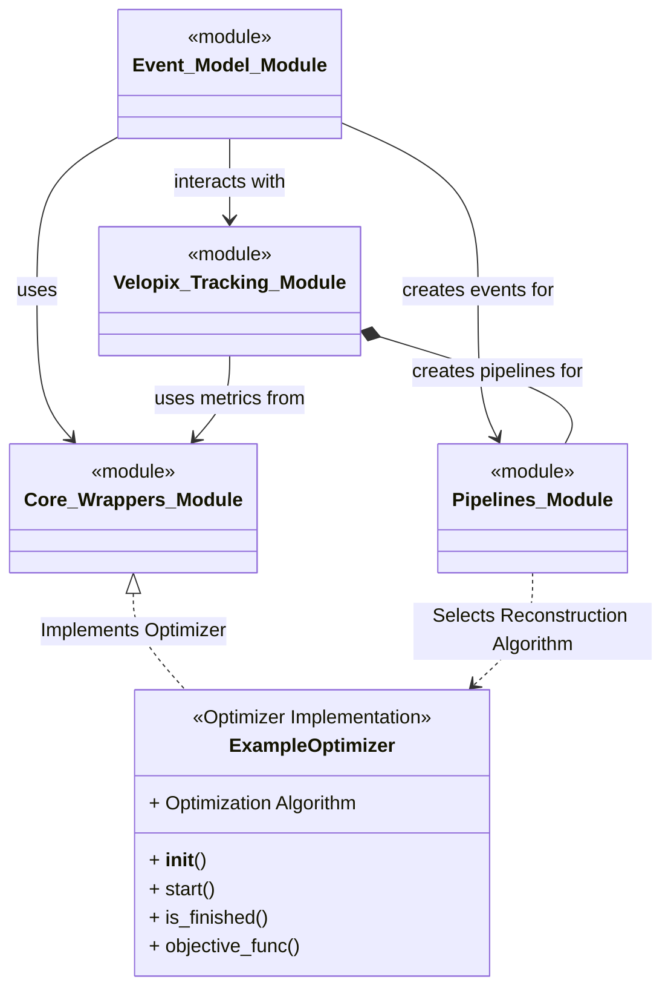
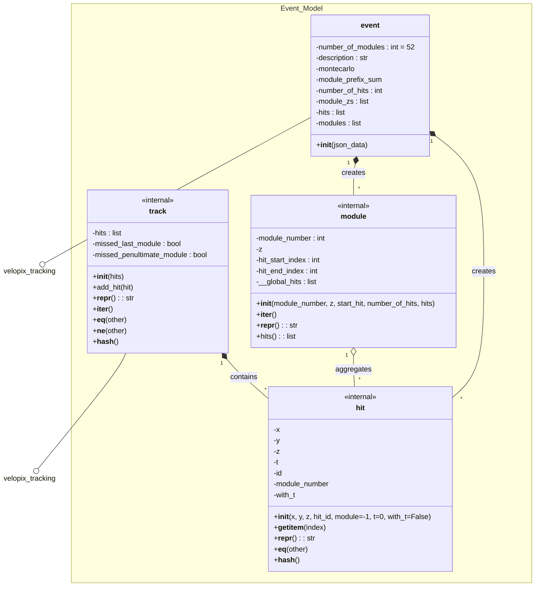
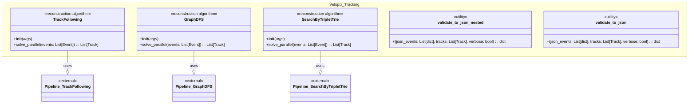
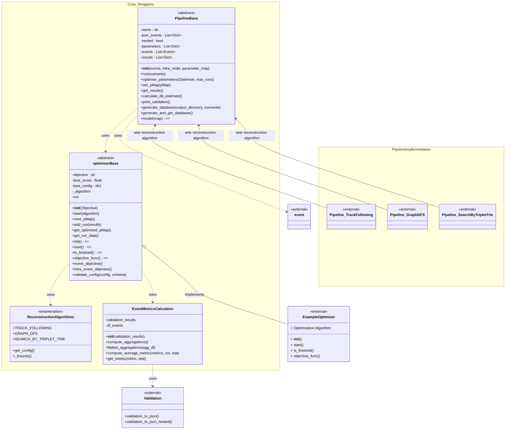

# Implementation and Abstraction

# Overview : how does everything interact

## Event Model : Class Diagram

## Velopix Tracking Algorithms : Class Diagram 

## Core Wrappers : Class Diagram

---

[Go Back](../readme.md)