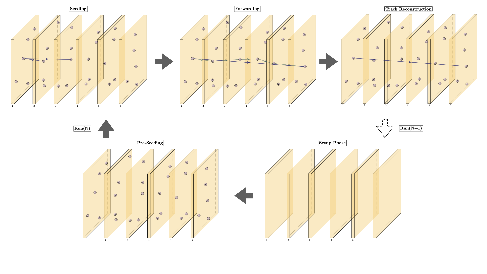
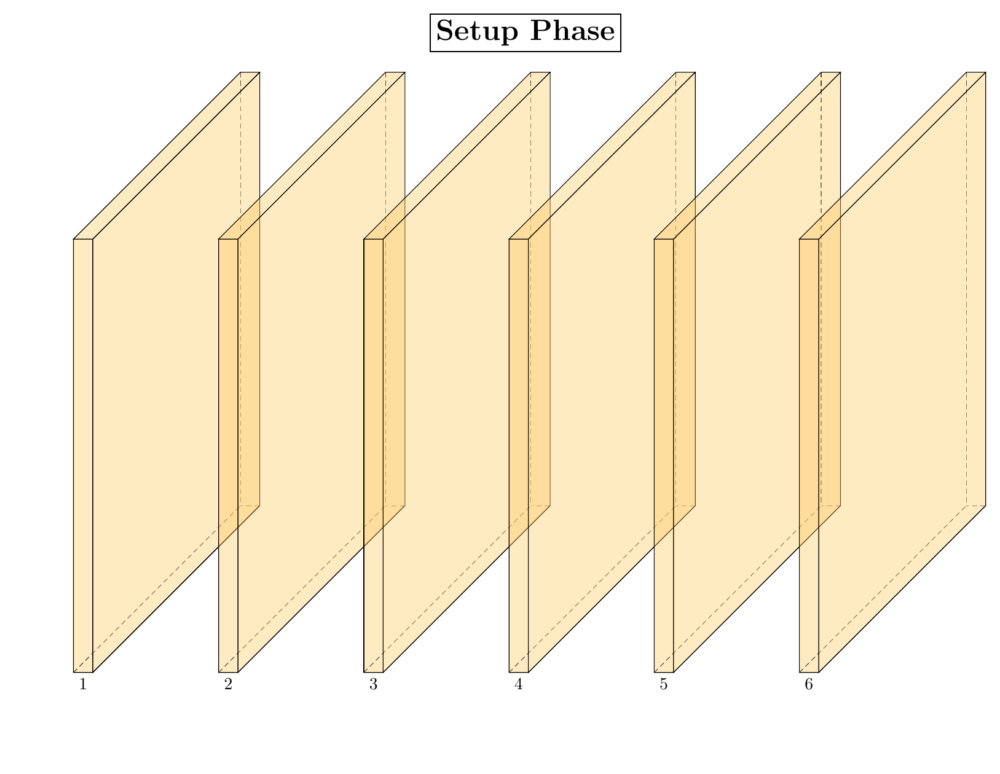
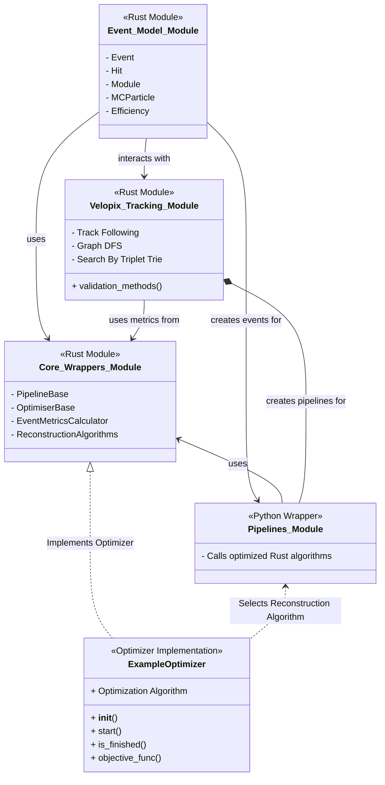

# Track Reconstruction Framework  

This repository provides a **high-performance track reconstruction framework** for processing real data from the **LHCb detector at CERN**. Charged particles moving at relativistic speeds leave **measurable hits** as they traverse detector modules. The objective is to **efficiently reconstruct particle trajectories with high accuracy**.

Execute the reconstruction pipeline with:
```bash
python3 run_track_reconstruction.py
```

For installation and setup instructions, refer to the [Installation Guide](./docs/INSTALLATION.md).

---

## Track Reconstruction Overview  

At the **LHCb detector**, high-energy collisions generate a multitude of charged particles, each leaving **spatial hit patterns** on detector modules.  
Each proton-proton collision forms an **event**, processed in real-time to reconstruct individual particle trajectories.

This repository provides:  
✔ **Optimized reconstruction algorithms in Rust for increased performance**  
✔ **Efficient event parsing and processing**  
✔ **Validation tools for performance assessment**  

The reconstruction algorithm **correlates recorded hits** with true particle trajectories to evaluate accuracy.



---

## How It Works  

For an in-depth explanation, see the [documentation](./docs/velopix_tracking.md).  

### **1. Loading Input Data**  

Input event files are provided in **JSON format**, parsed using the **event model** implemented in Rust.  

Example usage:
```python
from event_model import event_model as em
import json

with open("events/velo_event_0.json") as f:
    json_data = json.load(f)

event = em.event(json_data)
```

Each event consists of **52 detector modules**, registering **particle-induced hits**.

```python
print(len(event.modules))  # Output: 52
print(len(event.hits))     # Output: 996
```

Each recorded hit contains:
- **Hit ID**  
- **Spatial coordinates {x, y, z}**  

Example:
```python
print(event.hits[0])
# Output: #0 module 0 {9.18, -30.509, -288.08}
```

---

### **2. Track Reconstruction Algorithms**  

The reconstruction pipeline is fully implemented in **Rust**, significantly improving performance over previous implementations.  

This framework includes three distinct algorithms:  

- **Track-Following Algorithm**  
  Links hits across modules based on geometric constraints to form linear tracks.  
  [Details](./docs/ALGO_TrackFollowing.md)  

- **Graph-Based DFS Algorithm**  
  Constructs a directed graph where hits form nodes, and edges represent potential track connections. A depth-first search (DFS) identifies valid trajectories.  
  [Details](./docs/ALGO_DFS.md)  

- **Merged-Triplet Algorithm**  
  Groups detector modules into pairs and forms triplets of hits using a scatter metric. A search tree refines the reconstruction.  
  [Details](./docs/ALGO_SearchByTripletTree.md)  

#### **Reconstruction Process**  

The track reconstruction process consists of **three key stages**, each contributing to the identification and refinement of particle trajectories. The algorithms implemented in Rust optimize computational performance, ensuring fast and reliable reconstruction.  

1) **Seeding** – Identifying candidate track segments  
   - Hits detected across multiple detector modules are analyzed to identify potential track seeds.  
   - The algorithm selects **pairs or triplets of hits** that align within expected trajectory constraints.  
   - Seeding strategies vary across algorithms, with some prioritizing **geometrical alignment**, while others employ **graph-based clustering**.  

2) **Forwarding** – Extending and refining track candidates  
   - Once a seed is established, the algorithm **propagates the trajectory** by searching for additional hits along the expected particle path.  
   - Tracks are extended based on **momentum constraints, spatial continuity, and detector geometry**.  
   - Ambiguous tracks are handled using **scoring metrics**, filtering out those inconsistent with known particle kinematics.  

3) **Final Reconstruction** – Evaluating track quality and filtering invalid paths  
   - The final track candidates undergo **validation and refinement**.  
   - Track fitting techniques such as **Kalman filtering** can be applied to improve precision.  
   - The reconstruction efficiency is assessed based on:  
     - **Hit efficiency** – Fraction of true hits used in reconstructed tracks  
     - **Purity** – Fraction of hits in a track that originate from the same true particle  
     - **Track completeness** – Degree to which a track covers the full particle trajectory



---

### **3. Validation & Performance Metrics**  

Performance evaluation is based on three key metrics:  

✔ **Reconstruction Efficiency**  
   *Percentage of real tracks successfully reconstructed:*  
   ```math
   \frac{n_{reconstructed\_tracks}}{n_{real\_tracks}} = RC
   ```

✔ **Clone Tracks**  
   *Fraction of redundant reconstructions:*  
   ```math
   \frac{n_{clone\_tracks}}{n_{correct\_reconstructed\_tracks}} = CT
   ```

✔ **Ghost Tracks**  
   *Fraction of falsely reconstructed tracks:*  
   ```math
   \frac{n_{incorrect\_reconstructed\_tracks}}{n_{real\_tracks}} = GT
   ```

Run validation:
```python
from validator import validator_lite as vl
vl.validate_print([json_data], [tracks])
```

Example output:
```
148 tracks including        8 ghosts (  5.4%). Event average   5.4%
             velo :      126 from      134 ( 94.0%)        3 clones (  2.38%)  purity: ( 98.83%)  hitEff: ( 93.89%)
             long :       22 from       22 (100.0%)        1 clones (  4.55%)  purity: ( 99.52%)  hitEff: ( 93.80%)
        long>5GeV :        8 from        8 (100.0%)        0 clones (  0.00%)  purity: (100.00%)  hitEff: (100.00%)
```

---

### **4. System Architecture Overview**  

The framework is structured into modular components to facilitate **performance optimization and algorithm development**. The following diagram illustrates the interaction between key modules. For a more detailed overview, see [this reference](./docs/abstractions_diagram.md).


---

## **Key Improvements Over Previous Versions**  

- **Performance Gains:** The core **event model, reconstruction algorithms, and validation methods** have been rewritten in **Rust**, providing significant speed improvements over Python.  
- **Streamlined Implementation:** Removed redundant examples and simplified explanations while retaining all critical information.  
- **Abstraction:** Added vast amounts of abstraction to easily handle multiple algorithms and optimalisation methods.

For further details or contributions, consult the **[developer documentation](./docs/DEVELOPER_GUIDE.md)**.  
