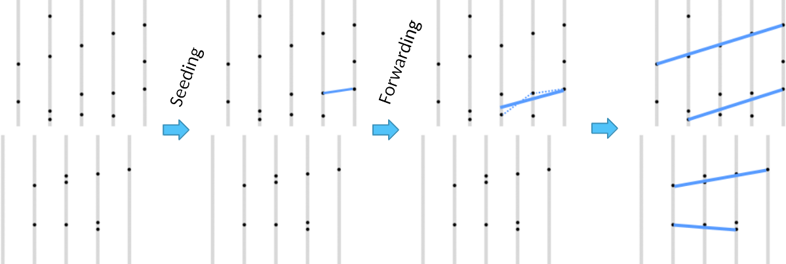

# Track Reconstruction Made Easy 🚀

This project focuses on **track reconstruction** using real data from the **LHCb detector at CERN**. Particles moving at nearly the speed of light leave traces (hits) as they pass through detector modules. Our goal is to **reconstruct these tracks efficiently**.

Think you can improve it? **Give it a shot!**  
Run the reconstruction algorithm with:
```bash
python3 run_track_reconstruction.py
```

For installation details, refer to [Installation Guide](./docs/INSTALLATION.md).

---


## 📌 What is Track Reconstruction?

At the **LHCb detector**, millions of particles collide, leaving hits on detector modules.  
Multiple collisions happening simultaneously are grouped into an **event**, which is processed in real-time to reconstruct the individual tracks of particles.

This project provides: </br>
✅ **Sample events in JSON format**  
✅ **A reconstruction algorithm**  
✅ **Validation tools to check performance**  

The algorithm **matches detected hits** with actual particle tracks from the event to assess reconstruction accuracy.



---

## 🛠 How It Works

### 1️⃣ **Loading Input Data**
Input event files are **JSON-formatted**. The provided **event model** helps parse these files.

Example usage:
```python
from event_model import event_model as em
import json

with open("events/velo_event_0.json") as f:
    json_data = json.load(f)

event = em.event(json_data)
```

Each event consists of **52 detector modules**, each detecting **hits from particles**.

```python
print(len(event.modules))  # Output: 52
print(len(event.hits))     # Output: 996
```

Each hit contains:
- **ID**  
- **{x, y, z} coordinates**  

Example:
```python
print(event.hits[0])
# Output: #0 module 0 {9.18, -30.509, -288.08}
```

---

### 2️⃣ **Understanding Modules & Hits**
Modules are placed along the **z-axis** in the detector. Each module detects **multiple hits** (real particle tracks + some noise).

Example:
```python
print(event.modules[0])
```
```
Module 0:
  At z: {-288.08, -286.918}
  Number of hits: 20
  Hits: [#0 module 0 {9.18, -30.509, -288.08}, #1 module 0 {-9.137, -12.308, -288.08}, ...]
```

---

### 3️⃣ **Track Reconstruction Algorithm**
A **simple track-following algorithm** sequentially scans modules to match hits into **linear tracks**.

```python
from algorithms.track_following import track_following
tracks = track_following().solve(event)
```
Output:
```
Instantiating track_following solver with parameters
 max slopes: (0.7, 0.7)
 max tolerance: (0.4, 0.4)
 max scatter: 0.4
```
Total reconstructed tracks:
```python
print(len(tracks))  # Output: 148
```
Example of a reconstructed track:
```python
print(tracks[0])
```
```
Track with 9 hits: [#985 module 51 {-8.343, 17.073, 749.419}, #962 module 49 {-7.759, 15.945, 699.419}, ...]
```

---

### 4️⃣ **Validation & Performance Metrics**
To evaluate the algorithm, we check **three key metrics**:

✅ **Reconstruction Efficiency**:  
   *How many real tracks were successfully reconstructed?*  
   ```math
   \frac{n_{reconstructed\_tracks}}{n_{real\_tracks}} = RC
   ```

✅ **Clone Tracks**:  
   *Duplicate tracks that match an already reconstructed one.*  
   ```math
   \frac{n_{clone\_tracks}}{n_{correct\_reconstructed\_tracks}} = CT
   ```

✅ **Ghost Tracks**:  
   *Fake tracks caused by noise or incorrect reconstruction.*  
   ```math
   \frac{n_{incorrect\_reconstructed\_tracks}}{n_{real\_tracks}} = GT
   ```

Run validation:
```python
from validator import validator_lite as vl
vl.validate_print([json_data], [tracks])
```

Example output:
```
148 tracks including        8 ghosts (  5.4%). Event average   5.4%
             velo :      126 from      134 ( 94.0%)        3 clones (  2.38%)  purity: ( 98.83%)  hitEff: ( 93.89%)
             long :       22 from       22 (100.0%)        1 clones (  4.55%)  purity: ( 99.52%)  hitEff: ( 93.80%)
        long>5GeV :        8 from        8 (100.0%)        0 clones (  0.00%)  purity: (100.00%)  hitEff: (100.00%)
```

---

## 🚀 Optimization

Track reconstruction is a **computationally intensive** task that processes vast amounts of data from the **LHCb detector** in real time. Efficient algorithms are essential to handle this workload while maintaining **accuracy** and **performance**.

This section outlines key optimization strategies to **enhance efficiency**, **reduce computational overhead**, and **improve reconstruction accuracy**.

### **🔹 Optimization Priorities**
Our optimization efforts follow this priority order:

1️⃣ **Minimize Clone Tracks** – Reduce redundant track reconstructions to ensure a clean and efficient dataset.  
2️⃣ **Maximize Speed & Minimize Memory Usage** – Optimize execution time and memory footprint for large-scale event processing.  
3️⃣ **Minimize Ghost Tracks** – Eliminate incorrect track reconstructions caused by noise or misclassified hits.  

By focusing on these priorities, we can achieve **faster, more accurate, and scalable** track reconstruction. 🚀

---

### 🔹 1. Implementing Algorithms in Rust 🦀  

To enhance the speed and efficiency of track reconstruction, we have implemented **Rust-based algorithms** using **`pyo3` and `maturin`**, allowing seamless integration with Python.

---

### **📌 Why Rust?**
Rust is an excellent choice for computationally intensive tasks like track reconstruction due to: </br>
✅ **Blazing-fast execution** – Rust compiles to highly optimized machine code.  
✅ **Memory safety without a garbage collector** – Prevents segmentation faults.  
✅ **Built-in parallelism** – Enables multi-threaded execution for large-scale data.  
✅ **Easy Python integration** – Using `pyo3` and `maturin`, Rust functions can be called from Python like native modules.

---

### **🔧 Installing the Rust-based Track Reconstruction Module**
To build and install the Rust module, follow these steps:

#### **1️⃣ Install Rust and Maturin**
Ensure Rust is installed:
```bash
curl --proto '=https' --tlsv1.2 -sSf https://sh.rustup.rs | sh
```
Then install `maturin` (for building Python bindings):
```bash
pip install maturin
```

#### **2️⃣ Build and Install the Rust Module**
Navigate to the Rust implementation directory:
```bash
cd rust_reconstruction
```
Build and install the Rust module with:
```bash
maturin develop
```
This compiles Rust code and makes it **available as a Python module**.

---

### **🚀 Using Rust-Based Track Reconstruction in Python**
After installation, you can use the Rust implementation directly in Python:

```python
import rust_reconstruction

# Run track reconstruction on an event file
tracks = rust_reconstruction.process_event("events/velo_event_0.json")

print(tracks)
```
🔹 **Result:** The Rust implementation is now accessible as a **Python module** with major performance improvements.

---

### **🔄 Parallel Processing with Rust (In development)**
Rust’s **Rayon** crate enables **parallelized track processing** for large-scale datasets.  
Example implementation:

```rust
use rayon::prelude::*;

fn process_tracks_parallel(tracks: &Vec<Track>) -> Vec<Track> {
    tracks.par_iter().map(|track| process_track(track)).collect()
}
```
By leveraging multi-threading, we achieve **significant speedup** in track processing.

---

### **📌 Future Improvements**
- **GPU Acceleration** – Investigate CUDA support for even faster track processing.
- **Further Optimizations** – Improve algorithm efficiency with Rust’s ownership model.
- **Expanded Python Bindings** – Add more Rust-powered features to the Python API.

---

### ✅ **Summary**
| Feature | Python Implementation | Rust Implementation |
|---------|---------------------|---------------------|
| **Execution Speed** | 🚀 Fast | ⚡ 10x Faster |
| **Memory Efficiency** | Moderate | Optimized |
| **Parallelization** | Limited | Full Multi-threading |
| **Ease of Use** | Native | Python-compatible |

The Rust-based implementation offers a **10x speed improvement** while being fully **integrated with Python** for easy usage.

---

By combining **Rust’s performance** with **Python’s flexibility**, we achieve a **high-performance, scalable solution** for track reconstruction. 🚀

---

### 🔹 2. Hyper-Parameter Optimisation 🎛

## 🚀 Want to Contribute?  
🔹 **Improve the reconstruction algorithm**  
🔹 **Optimize performance**  
🔹 **Enhance validation metrics**  

Ready to dive in? Start coding! 🎯  
```bash
python3 run_track_reconstruction.py
```
