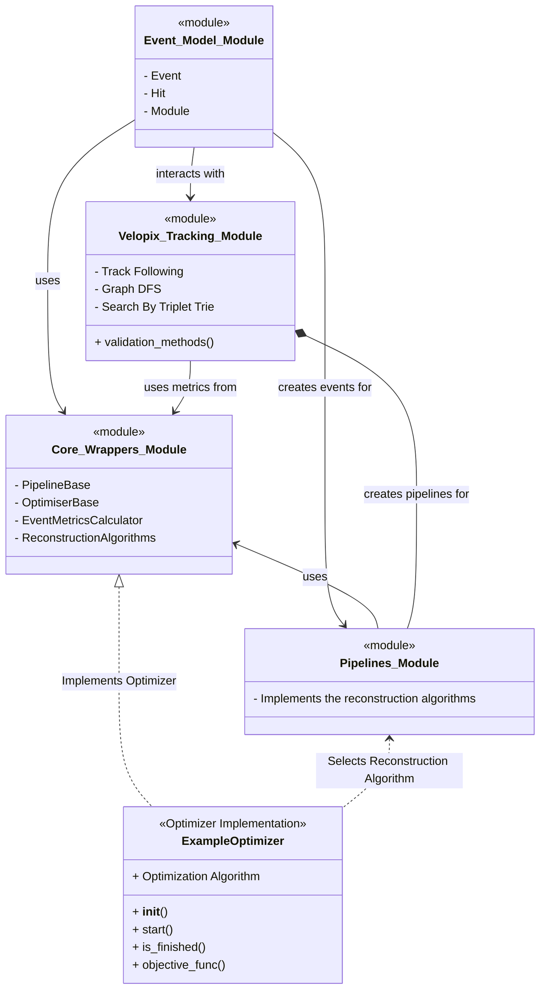

# Track Reconstruction Made Easy 🚀

This project focuses on **track reconstruction** using real data from the **LHCb detector at CERN**. Particles moving at nearly the speed of light leave traces (hits) as they pass through detector modules. Our goal is to **reconstruct these tracks efficiently**.

Think you can improve it? **Give it a shot!**  
Run the reconstruction algorithm with:
```bash
python3 run_track_reconstruction.py
```

For installation details, refer to [Installation Guide](./docs/INSTALLATION.md).

---


## 📌 What is Track Reconstruction?

At the **LHCb detector**, millions of particles collide, leaving hits on detector modules.  
Multiple collisions happening simultaneously are grouped into an **event**, which is processed in real-time to reconstruct the individual tracks of particles.

This project provides: </br>
✅ **Sample events in JSON format**  
✅ **Three reconstruction algorithm**  
✅ **Validation tools to check performance**  

The algorithm **matches detected hits** with actual particle tracks from the event to assess reconstruction accuracy.


---

## 🛠 How It Works
Also view the [documentation](./docs/velopix_tracking.md) of the custom `velopix_tracking` package. 
### 1️⃣ **Loading Input Data**
Input event files are **JSON-formatted**. The provided **event model** helps parse these files.

Example usage:
```python
from event_model import event_model as em
import json

with open("events/velo_event_0.json") as f:
    json_data = json.load(f)

event = em.event(json_data)
```

Each event consists of **52 detector modules**, each detecting **hits from particles**.

```python
print(len(event.modules))  # Output: 52
print(len(event.hits))     # Output: 996
```

Each hit contains:
- **ID**  
- **{x, y, z} coordinates**  

Example:
```python
print(event.hits[0])
# Output: #0 module 0 {9.18, -30.509, -288.08}
```

---

### 2️⃣ **Understanding Modules & Hits**
Modules are placed along the **z-axis** in the detector. Each module detects **multiple hits** (real particle tracks + some noise).

Example:
```python
print(event.modules[0])
```
```
Module 0:
  At z: {-288.08, -286.918}
  Number of hits: 20
  Hits: [#0 module 0 {9.18, -30.509, -288.08}, #1 module 0 {-9.137, -12.308, -288.08}, ...]
```

---

### 3️⃣ **Track Reconstruction Algorithms**

This project includes three distinct methods to reconstruct particle tracks from detector hits. Each algorithm employs a unique strategy to link hits into coherent tracks, allowing you to choose the one that best fits your data and analysis needs.

- **Simple Track-Following Algorithm**  
  This method sequentially scans the detector modules, matching hits based on geometric constraints to form linear tracks. </br>
  [Learn more](./docs/ALGO_TrackFollowing.md)  

- **Graph DFS Algorithm**  
  In this approach, hits are first grouped into segments which become the nodes of a directed graph. A depth-first search (DFS) is then used to traverse the graph and extract tracks. </br>
  [Learn more](./docs/ALGO_DFS.md)  

- **Final Merged-Triplet Algorithm**  
  This advanced method merges detector modules in pairs to reduce complexity and builds a trie of compatible hit triplets based on a scatter metric. It uses both seeding and forwarding strategies to generate tracks.</br>
  [Learn more](./docs/ALGO_SearchByTripletTree.md)


### 4️⃣ **Validation & Performance Metrics**
To evaluate the algorithm, we check **three key metrics**:

✅ **Reconstruction Efficiency**:  
   *How many real tracks were successfully reconstructed?*  
   ```math
   \frac{n_{reconstructed\_tracks}}{n_{real\_tracks}} = RC
   ```

✅ **Clone Tracks**:  
   *Duplicate tracks that match an already reconstructed one.*  
   ```math
   \frac{n_{clone\_tracks}}{n_{correct\_reconstructed\_tracks}} = CT
   ```

✅ **Ghost Tracks**:  
   *Fake tracks caused by noise or incorrect reconstruction.*  
   ```math
   \frac{n_{incorrect\_reconstructed\_tracks}}{n_{real\_tracks}} = GT
   ```

Run validation:
```python
from validator import validator_lite as vl
vl.validate_print([json_data], [tracks])
```

Example output:
```
148 tracks including        8 ghosts (  5.4%). Event average   5.4%
             velo :      126 from      134 ( 94.0%)        3 clones (  2.38%)  purity: ( 98.83%)  hitEff: ( 93.89%)
             long :       22 from       22 (100.0%)        1 clones (  4.55%)  purity: ( 99.52%)  hitEff: ( 93.80%)
        long>5GeV :        8 from        8 (100.0%)        0 clones (  0.00%)  purity: (100.00%)  hitEff: (100.00%)
```

---

### 5️⃣ Abstraction Overview
To streamline the parameter optimalisation of the reconstruction algorithms. A number of modules, classes and functions have been implemented. Below is an overview of how all these classes interact with eachother. For a more detailed overview [See this reference](./docs/abstractions_diagram.md).




---